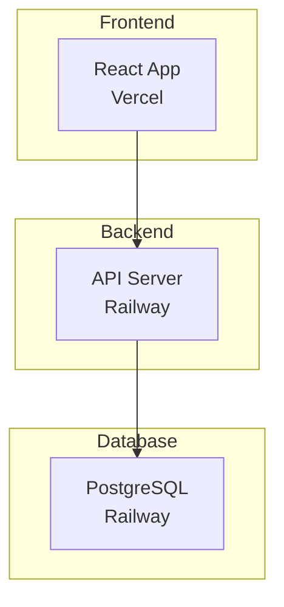

# [Project Name] - [Brief Description]

<div align="center">

**[One-line project description with key technologies]**

[](#)
[](#)

 

[View Live Demo](#) • [Report Issues](#)

</div>

---

## Live Application

| Service | URL | Status |
|---------|-----|--------|
| **Frontend** | [your-app.vercel.app](#) |  |
| **API** | [your-api.railway.app](#) |  |

---

## Key Features

<table>
<tr>
<td width="50%">

**Core Features**
- [Feature 1 description]
- [Feature 2 description]
- [Feature 3 description]

</td>
<td width="50%">

**Technical Highlights**
- [Technical achievement 1]
- [Technical achievement 2] 
- [Technical achievement 3]

</td>
</tr>
</table>

---

## Technology Stack

<div align="center">

### Frontend


### Backend


### Infrastructure


</div>

---

## Architecture



---

## Local Development

**Prerequisites:** Node.js 18+, PostgreSQL

```bash
# Clone repository
git clone https://github.com/username/project.git
cd project

# Install dependencies
npm install

# Environment setup
cp .env.example .env
# Configure your environment variables

# Start development
npm run dev  # Frontend: http://localhost:3000
```

---

## Project Timeline

### Sprint 1: Foundation ✅
- [x] Project setup and architecture
- [x] Database design and models
- [x] Basic API endpoints

### Sprint 2: Core Features 🚧
- [ ] [Feature implementation]
- [ ] [UI development]
- [ ] [Integration testing]

### Sprint 3: Polish & Deploy 📅
- [ ] [Performance optimization]
- [ ] [Final testing]
- [ ] [Production deployment]

---

## Contact

**[Your Name]** | [Your Title/School] | [Graduation Year]

[](#)
[](#)
[](#)

---

<div align="center">

**Interested in collaborating? Check out my other projects!**

[View Portfolio](#) • [Live Demo](#) • [Contact Me](#)

</div>