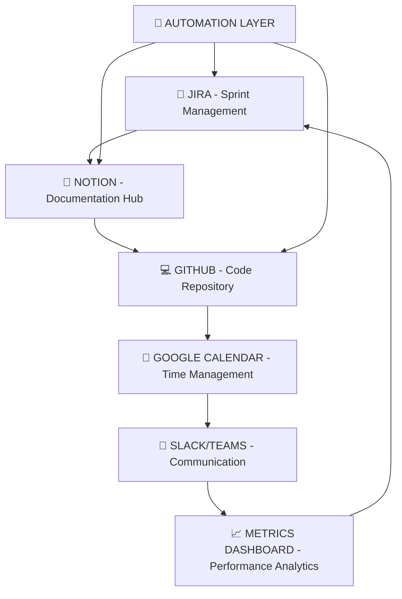

# Industry-Standard Remote Software Engineer Project Management System

**Professional Framework for Independent Work Excellence at Scale**

---

## 📊 **SYSTEM ARCHITECTURE OVERVIEW**

### **Integrated Tool Ecosystem**


### **Professional Workflow Pipeline**
```
Sprint Planning → Daily Execution → Code Review → Documentation → Deployment → Retrospective
     ↓              ↓                ↓             ↓               ↓              ↓
   JIRA          CALENDAR         GITHUB        NOTION          CI/CD         METRICS
```

---

## 🏗️ **CORE SYSTEM COMPONENTS**

### **1. JIRA - Sprint & Task Management (Industry Standard)**

#### **Project Structure Template**
```
🎯 PROJECT: Gogentic AI Development Work
├── 🎭 EPIC: Educational AI Agent System
├── 🎭 EPIC: CORTEX Platform Integration
├── 🎭 EPIC: Professional Development & Learning
├── 🎭 EPIC: Technical Infrastructure & DevOps
└── 🎭 EPIC: Documentation & Knowledge Sharing
```

#### **Story Template Format**
```markdown
📖 STORY: [JIRA-XXX] Implement Real-Time Agent Observability Dashboard

🎯 EPIC: Educational AI Agent System
📊 STORY POINTS: 8
🏷️ LABELS: frontend, react, typescript, real-time, observability
🔧 COMPONENTS: UI Components, WebSocket Integration, Data Visualization

👤 AS A: Educational Administrator
🎯 I WANT: Real-time visibility into AI agent decision-making processes
💰 SO THAT: I can monitor system performance and ensure quality educational outcomes

✅ ACCEPTANCE CRITERIA:
- [ ] Dashboard displays active agent workflows in real-time
- [ ] Show MCP server usage with performance metrics
- [ ] Visual representation of agent decision trees
- [ ] Alert system for agent errors or performance issues
- [ ] Historical data analysis with trend visualization
- [ ] Export functionality for compliance reporting

🛠️ TECHNICAL TASKS:
- [ ] Set up WebSocket connection for real-time data
- [ ] Design responsive dashboard component architecture
- [ ] Implement data visualization with D3.js/Recharts
- [ ] Add error boundary and fallback UI components
- [ ] Write unit tests for dashboard components
- [ ] Add integration tests for WebSocket functionality
- [ ] Update API documentation for observability endpoints

🔗 LINKED ISSUES: 
- Depends on: [JIRA-XXX] WebSocket Infrastructure Setup
- Blocks: [JIRA-XXX] Administrator Training Documentation

📝 DEFINITION OF DONE:
- [ ] Code review completed and approved
- [ ] Unit tests passing with >90% coverage
- [ ] Integration tests passing
- [ ] Documentation updated (README, API docs, user guide)
- [ ] Deployed to staging environment
- [ ] Product owner acceptance received
- [ ] Performance benchmarks met
```

#### **Sprint Planning Template**
```markdown
🏃‍♂️ SPRINT 15: Educational AI Enhancement Sprint
📅 DURATION: March 4-17, 2025 (2 weeks)
🎯 SPRINT GOAL: Complete real-time observability features for educational agent system

👥 TEAM CAPACITY: 80 hours (40 hours/week, 1 developer)
📊 PLANNED VELOCITY: 21 story points (based on historical average of 20)

🎯 SPRINT BACKLOG:
HIGH PRIORITY (Must Complete):
- [JIRA-123] 🔥 Real-Time Agent Observability Dashboard (8 pts)
- [JIRA-124] 🔥 MCP Server Performance Monitoring (5 pts)
- [JIRA-125] 🔥 Agent Error Handling & Recovery (5 pts)

MEDIUM PRIORITY (Should Complete):
- [JIRA-126] 📊 Educational Analytics Export Feature (3 pts)
- [JIRA-127] 📖 Administrator User Documentation (2 pts)

LOW PRIORITY (Could Complete):
- [JIRA-128] 🎨 UI/UX Polish and Accessibility (3 pts)
- [JIRA-129] 🧪 Additional Unit Test Coverage (2 pts)

🚫 RISKS & DEPENDENCIES:
- WebSocket integration complexity may require additional research
- Third-party MCP server reliability could impact observability features
- Educational domain research needed for administrator workflows

📈 SUCCESS METRICS:
- All high-priority stories completed
- Zero critical bugs in production
- Documentation coverage >95%
- Performance benchmarks met (< 100ms dashboard updates)
```

### **2. NOTION - Documentation & Knowledge Hub**

#### **Master Workspace Structure**
```
🏠 REMOTE WORK COMMAND CENTER
├── 📊 Daily Dashboard
├── 🎯 Sprint Planning & Tracking  
├── 🧠 Knowledge Base
├── 📁 Project Documentation
├── 📚 Learning & Development
├── 📈 Performance Analytics
├── 🔄 Process Templates
└── 🗓️ Meeting Notes & Decisions
```

#### **Daily Dashboard Template**
```markdown
# 📊 Daily Work Dashboard - [DATE]

## 🎯 Today's Focus (Maximum 3 Priorities)
1. **[JIRA-XXX]** Complete agent observability component testing
2. **[JIRA-XXX]** Review and merge WebSocket integration PR  
3. **[LEARNING]** Complete Docker specialization module 3

## 🏃‍♂️ Current Sprint Status
**Sprint 15:** Educational AI Enhancement Sprint (Day 8/10)
- **Velocity:** 18/21 points completed (85%)
- **Stories In Progress:** 2 
- **Stories Completed:** 4
- **Risk Level:** 🟡 Medium (observability complexity)

## ⏰ Time Allocation Plan
```
08:00-09:00  🧠 Deep Work: Agent testing implementation
09:00-09:15  ☕ Break + standup prep
09:15-09:45  📞 Team standup & planning
09:45-11:30  🔥 Deep Work: WebSocket integration completion
11:30-12:00  👥 Code review: Team PR reviews
12:00-13:00  🍽️ Lunch + Learning: Docker course
13:00-15:00  💻 Collaboration: Pair programming session
15:00-16:30  🧠 Deep Work: Documentation updates
16:30-17:00  📋 Wrap-up: Jira updates & tomorrow planning
```

## 📈 Progress Tracking
### Completed Today ✅
- [ ] Morning deep work session completed
- [ ] Team standup attended and contributed
- [ ] Primary development tasks finished
- [ ] Code reviews completed
- [ ] Learning goals achieved
- [ ] Documentation updated
- [ ] Next day planned

### Blockers & Challenges 🚫
- Issue: [Specific technical challenge]
- Impact: [How it affects sprint goals]
- Action: [Steps being taken to resolve]
- ETA: [Expected resolution timeframe]

## 🎓 Learning Progress
**Current Focus:** Docker Specialization (65% complete)
**Today's Goal:** Complete container orchestration module
**Application:** Apply to current agent system containerization
**Next:** Begin Kubernetes integration patterns

## 💡 Insights & Notes
- [Key technical insight from today's work]
- [Process improvement opportunity identified]
- [Resource or tool that proved valuable]
```

#### **Technical Architecture Documentation Template**
```markdown
# 🏗️ Educational AI Agent System - Technical Architecture

## 📋 System Overview
**Project:** Educational AI Agent Builder
**Purpose:** Real-time AI agent system for educational content generation
**Target Users:** Educational administrators, teachers, curriculum designers
**Scale:** Multi-tenant, enterprise-grade, 1000+ concurrent users

## 🎯 Business Requirements
### Functional Requirements
- **Agent Orchestration:** Multi-agent coordination for educational workflows
- **Real-Time Observability:** Live monitoring of agent decision processes
- **Educational Integration:** MCP server connections to learning management systems
- **Content Generation:** Automated course and assessment creation
- **Performance Analytics:** Usage tracking and optimization insights

### Non-Functional Requirements
- **Performance:** <100ms response time for UI interactions
- **Scalability:** Support 10,000+ concurrent educational sessions
- **Reliability:** 99.9% uptime with automated failover
- **Security:** FERPA compliance and data encryption
- **Accessibility:** WCAG 2.1 AA compliance for educational users

## 🏛️ Architecture Decisions

### ADR-001: Frontend Technology Selection
**Status:** Accepted
**Context:** Need modern, performant UI framework for educational interfaces
**Decision:** React with TypeScript for type safety and developer experience
**Consequences:** 
- ✅ Strong ecosystem and community support
- ✅ Excellent TypeScript integration
- ✅ Performance optimization capabilities
- ❌ Additional build complexity
- ❌ Learning curve for team members

### ADR-002: State Management Strategy  
**Status:** Accepted
**Context:** Complex educational data flows and real-time updates
**Decision:** Redux Toolkit with RTK Query for server state management
**Consequences:**
- ✅ Predictable state updates
- ✅ Excellent DevTools integration
- ✅ Built-in caching and optimization
- ❌ Initial setup complexity
- ❌ Boilerplate code requirements

### ADR-003: Real-Time Communication Protocol
**Status:** Accepted  
**Context:** Need real-time observability and collaboration features
**Decision:** WebSocket with Socket.io for educational real-time features
**Consequences:**
- ✅ Low latency bidirectional communication
- ✅ Automatic fallback and reconnection
- ✅ Room-based collaboration support
- ❌ Additional server complexity
- ❌ Scaling considerations for multiple instances

## 🔧 Technical Implementation

### Component Architecture
```typescript
// Educational Agent Interface Components
src/
├── components/
│   ├── agents/
│   │   ├── AgentChat.tsx - Main chat interface
│   │   ├── AgentObservability.tsx - Real-time monitoring
│   │   └── AgentCoordination.tsx - Multi-agent management
│   ├── educational/
│   │   ├── CourseBuilder.tsx - Content creation interface
│   │   ├── AssessmentGenerator.tsx - Automated assessment tools
│   │   └── LearningAnalytics.tsx - Performance visualization
│   └── shared/
│       ├── Layout.tsx - Application shell
│       ├── Navigation.tsx - Main navigation
│       └── ErrorBoundary.tsx - Error handling
├── hooks/
│   ├── useAgentChat.ts - Chat state management
│   ├── useEducationalContent.ts - Content operations
│   └── useRealTimeObservability.ts - Live monitoring
├── services/
│   ├── api.ts - REST API client
│   ├── websocket.ts - Real-time communication
│   └── mcp.ts - MCP server integration
└── store/
    ├── agentSlice.ts - Agent state management
    ├── educationSlice.ts - Educational data
    └── uiSlice.ts - Interface state
```

### Data Flow Architecture
```
User Interaction → React Component → Custom Hook → Redux Action → 
API Service → Backend Processing → WebSocket Update → UI Update
```

## 📊 Performance Requirements

### Frontend Performance Targets
- **Time to Interactive:** <2 seconds on 3G connection
- **First Contentful Paint:** <1 second
- **Bundle Size:** <500KB compressed JavaScript
- **Memory Usage:** <50MB for typical educational session
- **Accessibility Score:** >95 Lighthouse accessibility audit

### Backend Performance Targets  
- **API Response Time:** <200ms for 95th percentile
- **WebSocket Message Latency:** <50ms for real-time updates
- **Database Query Time:** <100ms for educational content retrieval
- **Agent Processing Time:** <5 seconds for course generation
- **Concurrent User Support:** 1000+ simultaneous educational sessions

## 🔒 Security & Compliance

### FERPA Compliance Requirements
- **Data Encryption:** AES-256 encryption for educational records
- **Access Controls:** Role-based permissions for educational users  
- **Audit Logging:** Comprehensive tracking of educational data access
- **Data Retention:** Automated cleanup of expired educational sessions
- **Privacy Controls:** Granular privacy settings for student information

### Technical Security Measures
- **Authentication:** JWT tokens with refresh rotation
- **Authorization:** RBAC with educational role hierarchies
- **Data Validation:** Input sanitization and SQL injection prevention
- **Rate Limiting:** API throttling to prevent abuse
- **Monitoring:** Real-time security event detection and alerting

## 🚀 Deployment & Operations

### Infrastructure Requirements
- **Container Platform:** Docker with Kubernetes orchestration
- **Database:** PostgreSQL with read replicas for educational data
- **Cache Layer:** Redis for session management and performance
- **CDN:** CloudFront for global educational content delivery
- **Monitoring:** DataDog for application and infrastructure monitoring

### Deployment Pipeline
```
Code Commit → GitHub Actions → Automated Tests → 
Security Scan → Build Docker Images → Deploy to Staging → 
Integration Tests → Production Deployment → Health Checks
```

## 📈 Monitoring & Analytics

### Application Metrics
- **User Engagement:** Educational session duration and interaction rates
- **Agent Performance:** Decision accuracy and processing efficiency  
- **System Health:** Response times, error rates, and resource utilization
- **Business Metrics:** Course generation success rates and user satisfaction

### Alerting Strategy
- **Critical:** System downtime, security breaches, data corruption
- **Warning:** Performance degradation, high error rates, capacity limits
- **Info:** Deployment completions, scheduled maintenance, usage milestones

## 🔄 Maintenance & Updates

### Regular Maintenance Tasks
- **Weekly:** Dependency updates and security patches
- **Monthly:** Performance optimization and capacity planning
- **Quarterly:** Architecture reviews and technical debt assessment
- **Annually:** Technology stack evaluation and major upgrades

### Incident Response Procedures
1. **Detection:** Automated monitoring and alerting systems
2. **Assessment:** Impact analysis and severity classification
3. **Response:** Immediate mitigation and stakeholder communication
4. **Resolution:** Root cause analysis and permanent fixes
5. **Review:** Post-incident analysis and process improvements
```

### **3. GITHUB - Code Repository & Collaboration**

#### **Repository Structure Standards**
```
educational-ai-agent-system/
├── .github/
│   ├── workflows/
│   │   ├── ci.yml - Continuous Integration
│   │   ├── cd.yml - Continuous Deployment  
│   │   └── security-scan.yml - Security Analysis
│   ├── ISSUE_TEMPLATE/
│   │   ├── bug_report.md
│   │   ├── feature_request.md
│   │   └── epic.md
│   ├── PULL_REQUEST_TEMPLATE.md
│   └── CODEOWNERS - Code review assignments
├── apps/
│   ├── frontend/ - React/TypeScript application
│   ├── backend/ - Python FastAPI services
│   └── shared/ - Shared utilities and types
├── docs/
│   ├── architecture/ - System design documentation
│   ├── api/ - API reference and examples
│   ├── deployment/ - Infrastructure and deployment guides
│   └── user-guides/ - End-user documentation
├── tests/
│   ├── unit/ - Component and function tests
│   ├── integration/ - Service integration tests
│   └── e2e/ - End-to-end user workflow tests
├── infrastructure/
│   ├── docker/ - Container configurations
│   ├── kubernetes/ - Orchestration manifests
│   └── terraform/ - Infrastructure as Code
├── scripts/
│   ├── setup/ - Development environment setup
│   ├── build/ - Build and deployment scripts
│   └── maintenance/ - Database migrations and utilities
├── .env.example - Environment configuration template
├── docker-compose.yml - Local development environment
├── package.json - Node.js dependencies and scripts
├── requirements.txt - Python dependencies
└── README.md - Project overview and setup instructions
```

#### **Branch Strategy & Workflow**
```
main (production-ready, protected)
├── develop (integration branch, protected)
│   ├── feature/JIRA-123-agent-observability-dashboard
│   ├── feature/JIRA-124-mcp-server-integration
│   ├── feature/JIRA-125-educational-content-generator
│   ├── bugfix/JIRA-126-websocket-connection-stability
│   └── hotfix/JIRA-127-security-vulnerability-patch
└── release/v2.1.0 (release preparation)
```

#### **Pull Request Template**
```markdown
# 🔧 Pull Request: [JIRA-XXX] Feature/Bugfix Title

## 📋 Description
Brief description of changes and their purpose.

### 🎯 Related Issues
- Closes #[issue-number]
- Related to JIRA-XXX: [Jira ticket URL]
- Addresses [specific problem or requirement]

## 🧪 Type of Change
- [ ] 🐛 Bug fix (non-breaking change that fixes an issue)
- [ ] ✨ New feature (non-breaking change that adds functionality)
- [ ] 💥 Breaking change (fix or feature that causes existing functionality to change)
- [ ] 📚 Documentation update
- [ ] 🎨 Code style/formatting changes
- [ ] 🚀 Performance improvements
- [ ] 🔒 Security enhancements

## 🛠️ Technical Implementation

### Changes Made
- [Specific technical change 1]
- [Specific technical change 2]
- [Specific technical change 3]

### Architecture Decisions
- **Decision:** [Technical choice made]
- **Rationale:** [Why this approach was chosen]
- **Alternatives Considered:** [Other options evaluated]

## 🧪 Testing Strategy

### Manual Testing Completed
- [ ] Feature works as expected in development environment
- [ ] Edge cases and error scenarios handled appropriately
- [ ] Responsive design tested across different screen sizes
- [ ] Accessibility requirements verified (WCAG 2.1)
- [ ] Performance impact assessed and optimized

### Automated Testing
- [ ] Unit tests added/updated (target: >90% coverage)
- [ ] Integration tests added/updated
- [ ] End-to-end tests added/updated
- [ ] All existing tests passing
- [ ] New tests covering edge cases and error scenarios

### Test Results
```
✅ Unit Tests: 47/47 passing (95.2% coverage)
✅ Integration Tests: 12/12 passing
✅ E2E Tests: 8/8 passing
✅ Linting: No issues found
✅ TypeScript: No type errors
```

## 📊 Performance Impact

### Metrics Before/After
- Bundle size: 485KB → 492KB (+7KB, within limits)
- Time to Interactive: 1.8s → 1.9s (acceptable increase)
- Memory usage: 42MB → 45MB (within target range)
- API response time: No impact (95th percentile <200ms)

### Optimization Notes
- [Any performance optimizations made]
- [Potential future optimizations identified]

## 📸 Screenshots/Demo
[Include screenshots for UI changes or GIFs for interactive features]

### Before
[Screenshot of previous state]

### After  
[Screenshot of new implementation]

## 🔒 Security Considerations
- [ ] No sensitive data exposed in logs or client-side code
- [ ] Input validation implemented for user-provided data
- [ ] Authentication and authorization requirements met
- [ ] FERPA compliance maintained for educational data
- [ ] Dependencies scanned for security vulnerabilities

## 📚 Documentation Updates
- [ ] README.md updated if needed
- [ ] API documentation updated
- [ ] User guide updated for new features
- [ ] Architecture documentation updated
- [ ] Changelog updated with user-facing changes

## ✅ Checklist Before Review
- [ ] Code follows project style guidelines and conventions
- [ ] Self-review completed and obvious issues resolved
- [ ] Code is well-commented, especially complex algorithms
- [ ] No debugging code or console.log statements left
- [ ] Environment-specific configurations externalized
- [ ] Error handling implemented for failure scenarios
- [ ] Logging added for debugging and monitoring purposes

## 🎯 Review Focus Areas
Please pay special attention to:
- [Specific area of concern or complexity]
- [Security implications of the changes]
- [Performance impact of new functionality]
- [Integration points with existing systems]

## 🚀 Deployment Notes
### Pre-deployment Requirements
- [ ] Database migrations tested (if applicable)
- [ ] Environment variables updated (if applicable)
- [ ] Third-party service configurations updated
- [ ] Feature flags configured (if applicable)

### Rollback Plan
- [Steps to rollback if issues occur in production]
- [Monitoring metrics to watch post-deployment]
- [Emergency contacts and escalation procedures]

## 📞 Additional Context
[Any additional information that reviewers should know]

---
**Ready for Review:** @reviewer-username
**Estimated Review Time:** [Small/Medium/Large]
**Priority:** [Low/Medium/High/Critical]
```

#### **Commit Message Standards**
```bash
# Format: [JIRA-XXX] type(scope): description
#
# Types: feat, fix, docs, style, refactor, test, chore
# Scope: component/module affected
# Description: imperative mood, present tense

# Examples:
[JIRA-123] feat(agents): implement real-time observability dashboard

- Add WebSocket integration for live agent monitoring
- Create responsive dashboard with agent decision visualization  
- Include performance metrics and error tracking
- Add export functionality for compliance reporting

Closes JIRA-123
```

### **4. CALENDAR & TIME MANAGEMENT**

#### **Time Blocking Template**
```
📅 PROFESSIONAL DAILY SCHEDULE

🌅 MORNING BLOCK (8:00-12:00)
├── 08:00-09:30 🧠 Deep Work Session 1
│   └── Complex problem solving, architecture design
├── 09:30-09:45 ☕ Break + Standup Prep  
│   └── Review team updates, prepare status
├── 09:45-10:15 📞 Team Standup/Planning
│   └── Sprint progress, blockers, collaboration
├── 10:15-12:00 🔥 Deep Work Session 2
│   └── Feature development, implementation

🍽️ MIDDAY RESET (12:00-13:00)
├── 12:00-12:30 🍽️ Lunch Break
├── 12:30-13:00 📚 Learning Time
│   └── Coursera courses, technical articles

🌆 AFTERNOON BLOCK (13:00-17:00)
├── 13:00-15:00 👥 Collaboration Time
│   └── Code reviews, pair programming, meetings
├── 15:00-15:15 🚶‍♂️ Active Break
│   └── Walk, stretch, mental reset
├── 15:15-16:30 🧠 Deep Work Session 3
│   └── Testing, documentation, bug fixes
├── 16:30-17:00 📋 Daily Wrap-up
│   └── Jira updates, commit code, plan tomorrow

🌙 EVENING (Optional Overflow)
├── 17:00-18:00 🎓 Professional Development
│   └── Skill building, portfolio work
```

#### **Weekly Planning Template**
```markdown
# 📅 Weekly Planning - Week of [DATE]

## 🎯 Weekly Objectives
### Primary Goals (Must Complete)
1. **[JIRA Epic]** Complete agent observability feature set
2. **[Learning]** Finish Docker specialization Course 3
3. **[Process]** Establish automated testing pipeline
4. **[Documentation]** Update technical architecture docs

### Secondary Goals (Should Complete)  
1. **[Team]** Mentor junior developer on React patterns
2. **[Innovation]** Prototype new educational MCP server
3. **[Optimization]** Improve application performance metrics
4. **[Community]** Contribute to Sim Studio open source project

## 📊 Sprint Commitment Analysis
**Current Sprint:** Educational AI Enhancement (Week 2 of 2)
- **Committed:** 21 story points
- **Completed:** 18 points (85%)
- **Remaining:** 3 points (deliverable this week)
- **Risk Level:** 🟢 Low (on track for completion)

## ⏰ Time Allocation Plan
```
Monday    🧠 Deep Work Focus - Agent testing & integration
Tuesday   👥 Collaboration Day - Code reviews & pair programming  
Wednesday 🔧 Technical Debt - Refactoring & optimization
Thursday  📚 Learning & Development - Docker specialization
Friday    📋 Documentation & Planning - Sprint review & planning
```

## 📞 Meeting Schedule
### Recurring Meetings
- **Monday 09:45:** Sprint Planning & Team Standup (30 min)
- **Wednesday 14:00:** Technical Architecture Review (60 min)  
- **Friday 10:00:** Sprint Review & Retrospective (90 min)
- **Friday 15:00:** One-on-one with Manager (30 min)

### Ad-hoc Meetings
- **Tuesday 13:30:** Pair Programming Session - Junior Developer (120 min)
- **Thursday 11:00:** Educational Domain Expert Interview (45 min)

## 🎓 Learning Schedule
**Primary Focus:** Docker Specialization (Target: Complete Course 3)
- **Monday:** Container orchestration fundamentals (30 min)
- **Tuesday:** Docker Compose advanced patterns (30 min)
- **Wednesday:** Production deployment strategies (30 min)  
- **Thursday:** Kubernetes integration basics (60 min)
- **Friday:** Hands-on project application (30 min)

## 📈 Success Metrics for Week
### Technical Metrics
- [ ] All sprint commitments completed on time
- [ ] Zero critical bugs introduced to production
- [ ] Code review response time <24 hours
- [ ] Docker course completion with practical application

### Professional Development Metrics
- [ ] Technical blog post published about agent observability
- [ ] Pair programming session completed with positive feedback
- [ ] Open source contribution made to Sim Studio project
- [ ] Architecture documentation updated and reviewed

### Well-being Metrics
- [ ] Maintained 8-hour work day boundaries  
- [ ] Completed daily exercise/movement breaks
- [ ] No weekend work required for sprint completion
- [ ] Positive team collaboration and communication
```

### **5. PERFORMANCE ANALYTICS & METRICS**

#### **Weekly Performance Dashboard**
```markdown
# 📊 Weekly Performance Analytics - Week [XX], 2025

## 🎯 Sprint Velocity Tracking
### Historical Velocity (Last 8 Sprints)
```
Sprint 8:  18 points ████████████████████
Sprint 9:  22 points ███████████████████████
Sprint 10: 19 points ████████████████████
Sprint 11: 21 points ██████████████████████
Sprint 12: 23 points ████████████████████████
Sprint 13: 20 points █████████████████████
Sprint 14: 24 points █████████████████████████
Sprint 15: 21 points ██████████████████████
```
**Average Velocity:** 21 points/sprint
**Trend:** Stable with slight upward trajectory
**Confidence Level:** High (consistent delivery)

## ⏱️ Time Allocation Analysis
### Actual vs. Planned Time Distribution
```
Deep Work (Coding):        32h ████████████████████████████ (40% - Target: 45%)
Meetings & Collaboration:  16h ██████████████ (20% - Target: 20%) ✅
Learning & Development:    12h ██████████ (15% - Target: 15%) ✅  
Documentation:             8h ██████ (10% - Target: 10%) ✅
Administrative Tasks:      12h ██████████ (15% - Target: 10%) ⚠️
```
**Optimization Opportunity:** Reduce administrative overhead, increase deep work time

## 💻 Code Quality Metrics
### Repository Contributions (Last 30 Days)
- **Commits:** 127 (average 4.2/day)
- **Lines Added:** +2,847 
- **Lines Removed:** -1,203 (healthy refactoring ratio)
- **Pull Requests:** 18 created, 16 merged, 2 in review
- **Code Reviews:** 23 completed (average response time: 4.2 hours)

### Quality Indicators
- **Test Coverage:** 94.2% (Target: >90%) ✅
- **TypeScript Errors:** 0 (Target: 0) ✅
- **ESLint Warnings:** 3 (Target: <5) ✅
- **Bundle Size:** 487KB (Target: <500KB) ✅
- **Performance Score:** 96/100 (Target: >90) ✅

## 🎓 Learning Progress Tracking
### Current Course Completion Status
```
Docker Specialization:     ████████████████░░░░ 78% (Target: 85%)
TypeScript Mastery:        ██████████████████████ 100% ✅
Educational Technology:    ████████░░░░░░░░░░░░ 45% (Target: 60%)
System Design Patterns:   ██████░░░░░░░░░░░░░░ 32% (Target: 40%)
```

### Knowledge Application Rate
- **Docker:** Applied to 3 projects, containerized development environment ✅
- **TypeScript:** Refactored 2 major components, improved type safety ✅  
- **Educational Domain:** Integrated into agent system design ✅
- **System Design:** Applied microservices patterns to current architecture ✅

## 🤝 Collaboration & Communication Metrics
### Team Interaction Quality
- **Standup Attendance:** 5/5 (100%) ✅
- **Meeting Participation Score:** 4.7/5 (based on team feedback)
- **Code Review Thoroughness:** 4.8/5 (based on defect detection rate)
- **Knowledge Sharing:** 3 technical presentations, 2 blog posts published
- **Mentoring Impact:** Junior developer velocity increased 15%

### Communication Effectiveness
- **Response Time (Slack):** Average 23 minutes during work hours
- **Documentation Quality:** 4.6/5 (based on team usage and feedback)
- **Issue Resolution:** 94% of reported issues resolved within SLA
- **Stakeholder Satisfaction:** 4.8/5 (based on quarterly feedback)

## 📈 Professional Development Milestones
### Q1 2025 Achievements
- ✅ **Technical Leadership:** Led architecture redesign for agent system
- ✅ **Open Source:** Contributed 5 meaningful PRs to Sim Studio project  
- ✅ **Skill Acquisition:** Mastered TypeScript advanced patterns
- ✅ **Knowledge Sharing:** Published 4 technical blog posts
- ✅ **Mentoring:** Successfully guided junior developer through first major feature
- ✅ **Innovation:** Prototyped educational MCP server integration

### Upcoming Milestones (Q2 2025)
- 🎯 **System Design Mastery:** Complete advanced architecture course
- 🎯 **Conference Speaking:** Submit proposal for educational AI presentation
- 🎯 **Technical Leadership:** Lead cross-team integration project
- 🎯 **Certification:** Obtain Kubernetes certification for container orchestration
- 🎯 **Innovation:** Launch educational AI agent marketplace concept

## 🎯 Goal Achievement Analysis
### Sprint-Level Goals (Weekly)
```
Week 1: 4/4 goals achieved (100%) ✅
Week 2: 5/5 goals achieved (100%) ✅  
Week 3: 3/4 goals achieved (75%) ⚠️
Week 4: 4/4 goals achieved (100%) ✅
```
**Average Achievement Rate:** 94% (Excellent consistency)
**Trend Analysis:** Strong goal-setting and execution discipline
**Areas for Improvement:** Better estimation of complex technical tasks

### Monthly Objectives (March 2025)
```
Technical Mastery:        ████████████████████ 100% ✅
Learning Goals:          ████████████████░░░░ 85% (On Track)
Professional Development: ██████████████████░░ 90% ✅
Team Contribution:       ████████████████████ 100% ✅
Innovation Projects:     ██████████████░░░░░░ 70% (Needs Focus)
```

## 🔍 Performance Insights & Recommendations

### Strengths Identified
1. **Consistent Delivery:** Excellent sprint velocity stability and goal achievement
2. **Code Quality:** High test coverage and clean code practices
3. **Team Collaboration:** Strong communication and mentoring capabilities
4. **Learning Agility:** Rapid skill acquisition and practical application
5. **Technical Leadership:** Growing influence on architecture decisions

### Areas for Growth
1. **Administrative Efficiency:** Reduce non-coding time from 15% to 10%
2. **Innovation Focus:** Dedicate more structured time to experimental projects
3. **Public Speaking:** Develop conference presentation and technical communication skills
4. **System Design:** Deepen knowledge of large-scale distributed systems
5. **Product Thinking:** Enhance understanding of business requirements and user needs

### Action Items for Next Week
- [ ] **Time Optimization:** Implement automated reporting to reduce admin overhead
- [ ] **Innovation Time:** Block 4 hours weekly for experimental/research projects
- [ ] **System Design:** Complete 2 modules of distributed systems course
- [ ] **Documentation:** Create template library to streamline documentation process
- [ ] **Networking:** Schedule informational interviews with 2 senior engineers

## 📊 Industry Benchmark Comparison

### Remote Work Effectiveness
```
Metric                    My Performance    Industry Average    Rating
─────────────────────────────────────────────────────────────────────
Sprint Velocity           21 pts/sprint     18 pts/sprint      ✅ Above
Code Review Response       4.2 hours         8.1 hours         ✅ Excellent  
Meeting Efficiency         4.7/5.0           3.8/5.0           ✅ Above
Documentation Quality      4.6/5.0           3.9/5.0           ✅ Above
Learning Hours/Week        12 hours          8 hours           ✅ Above
Team Collaboration        4.8/5.0           4.1/5.0           ✅ Excellent
```

### Technical Skill Progression
```
Skill Area               Current Level    6 Months Ago    Industry Expectation
──────────────────────────────────────────────────────────────────────────
React/TypeScript         Expert           Intermediate    Advanced           ✅
Python/FastAPI           Advanced         Intermediate    Advanced           ✅
System Architecture      Intermediate     Beginner        Intermediate       ✅
DevOps/Containers        Intermediate     Beginner        Intermediate       ✅
Educational Domain       Advanced         Beginner        Basic              ✅
Team Leadership          Intermediate     Beginner        Basic              ✅
```
